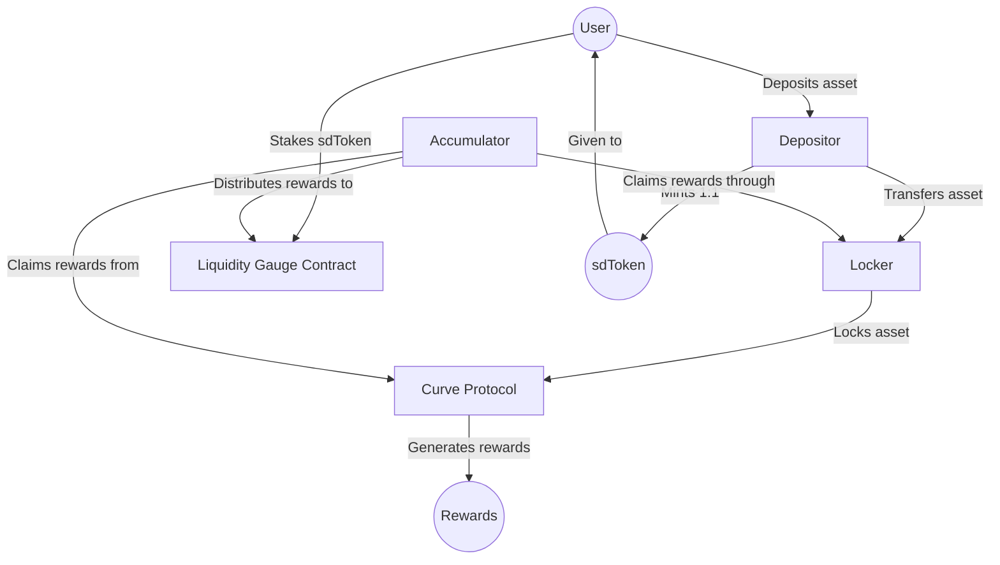

```mermaid
flowchart TD
    User((User))
    Depositor[Depositor]
    Locker[Locker]
    Curve[Curve Protocol]
    LiquidityGauge[Liquidity Gauge Contract]
    Accumulator[Accumulator]

    User -->|Deposits asset| Depositor
    Depositor -->|Mints 1:1| sdToken((sdToken))
    sdToken -->|Given to| User
    Depositor -->|Transfers asset| Locker
    Locker -->|Locks asset| Curve
    User -->|Stakes sdToken| LiquidityGauge
    Curve -->|Generates rewards| Rewards((Rewards))
    Accumulator -->|Claims rewards through| Locker
    Accumulator -->|Claims rewards from| Curve
    Accumulator -->|Distributes rewards to| LiquidityGauge
```
