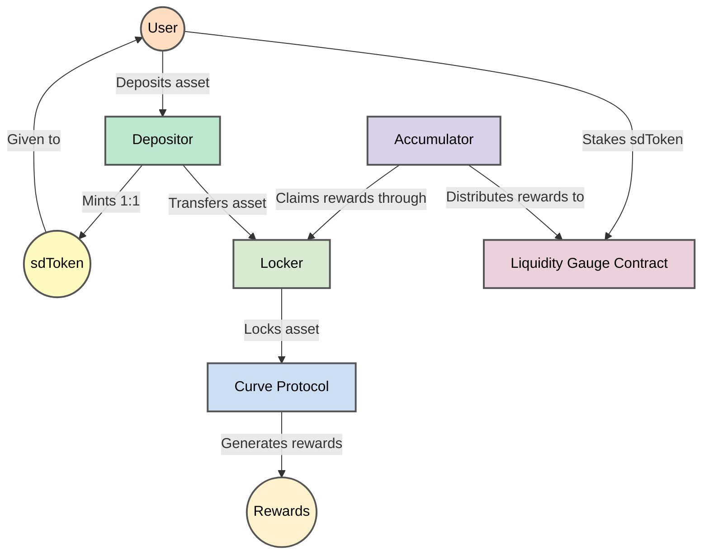

```mermaid
flowchart TD

    %% --- Nodes with Colors ---
    classDef userStyle fill:#FFDDC1, stroke:#FF6700, color:#000;
    classDef depositorStyle fill:#BBE8CF, stroke:#21A179, color:#000;
    classDef sdTokenStyle fill:#FFFABF, stroke:#FFC107, color:#000;
    classDef lockerStyle fill:#D9EAD3, stroke:#6AA84F, color:#000;
    classDef curveStyle fill:#CEDEF2, stroke:#3C78B5, color:#000;
    classDef gaugeStyle fill:#EAD1DC, stroke:#CC0000, color:#000;
    classDef accumulatorStyle fill:#D9D2E9, stroke:#6B24A0, color:#000;
    classDef rewardsStyle fill:#FFF2CC, stroke:#E69138, color:#000;

    User((User)):::userStyle
    Depositor[Depositor]:::depositorStyle
    sdToken((sdToken)):::sdTokenStyle
    Locker[Locker]:::lockerStyle
    Curve[Curve Protocol]:::curveStyle
    LiquidityGauge[Liquidity Gauge Contract]:::gaugeStyle
    Accumulator[Accumulator]:::accumulatorStyle
    Rewards((Rewards)):::rewardsStyle

    %% --- Edges with Styles ---
    classDef defaultEdge stroke-width:2px, stroke:#555;

    User -->|Deposits asset| Depositor
    Depositor -->|Mints 1:1| sdToken
    sdToken -->|Given to| User
    Accumulator -->|Claims rewards through| Locker
    Depositor -->|Transfers asset| Locker
    Locker -->|Locks asset| Curve
    User -->|Stakes sdToken| LiquidityGauge
    Curve -->|Generates rewards| Rewards
    Accumulator -->|Distributes rewards to| LiquidityGauge

    %% --- Edges Class ---
    class User,Depositor,sdToken,Locker,Curve,LiquidityGauge,Accumulator,Rewards defaultEdge;

```
